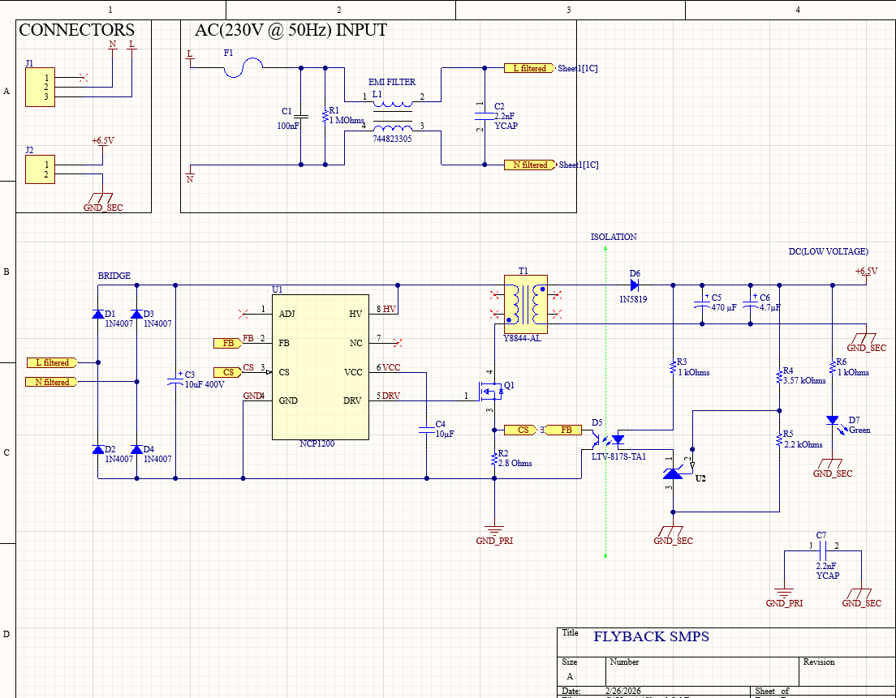
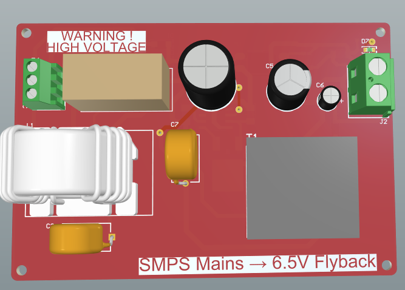
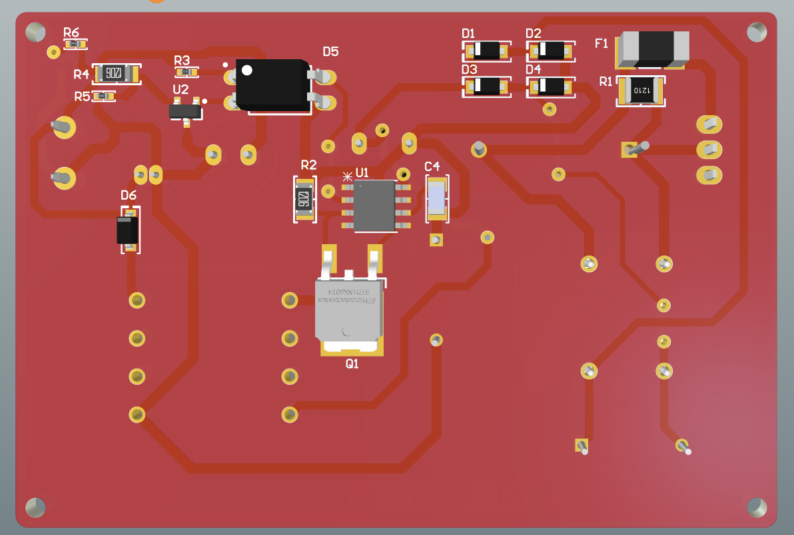

# 15W Isolated Flyback SMPS (230VAC to 6.5VDC)

## 📌 Project Overview
This repository contains the full hardware design for a compact, high-voltage Switch Mode Power Supply (SMPS). The design is based on the **NCP1200** PWM controller and is optimized for low component count while maintaining high reliability and safety.

The project was developed using **Altium Designer** and includes everything from schematics and PCB layout to manufacturing files (Gerbers) and a detailed Bill of Materials (BOM).

[Download Full PDF Documentation](Docs/Flyback_SMPS_Documentation.pdf)

## ⚙️ Technical Specifications
| Parameter | Value |
|-----------|-------|
| **Input Voltage** | 230V AC @ 50Hz (Nominal) |
| **Output Voltage** | 6.5V DC (Regulated) |
| **Max Power Output**| ~15W |
| **Topology** | Isolated Flyback |
| **Controller** | ON Semi NCP1200 (Current-Mode PWM) |
| **Switching Freq** | 60 kHz |
| **Feedback Loop** | Optoisolated (LTV-817) with TL431 Shunt Regulator |

## 🚀 Key Features & Design Decisions

### 1. Safety & Mechanical Design (Class I Isolation)
The input connector (J1) features a 3-pin configuration where **Pin 3 is designated for Protective Earth (PE)**. 
- **Chassis Grounding:** The design is intended to be housed in a metallic enclosure where PE is bonded to the chassis.
- **Creepage & Clearance:** PCB layout follows strict distance rules between Primary and Secondary sides to ensure galvanic isolation and user safety.

### 2. EMI Management
To comply with electromagnetic compatibility standards, the design includes:
- **Input Pi-Filter:** Common Mode Choke (L1) and X2 Capacitor (C1) to reduce conducted emissions.
- **Y-Capacitors (C2, C7):** Strategically placed to provide a low-impedance path for switching noise across the isolation barrier.

### 3. Efficiency & BOM Optimization
- **NCP1200 Benefits:** By using the NCP1200's internal high-voltage current source for startup, the design eliminates the need for an auxiliary transformer winding, significantly reducing transformer complexity and cost.

## 📂 Project Structure
- **/Design_Files**: Altium Designer source files (.PrjPcb, .SchDoc, .PcbDoc, and Libraries).
- **/Manufacturing**: Production-ready files (Gerber RS-274X, NC Drill, and BOM).
- **/Docs**: Full project documentation, including a comprehensive PDF containing schematics and 3D renders.
- **/Images**: Visual previews of the schematic and the final 3D PCB layout.

## ⚠️ Safety Warning
**HIGH VOLTAGE HAZARD:** This circuit operates at 230V AC. Lethal voltages are present on the primary side. This project is for educational and professional evaluation purposes only. Use an isolation transformer and follow all safety protocols when testing.

---
**Designed by:** Onichi Ionut-Tiberiu  
**Tools:** Altium Designer, GitHub Desktop.